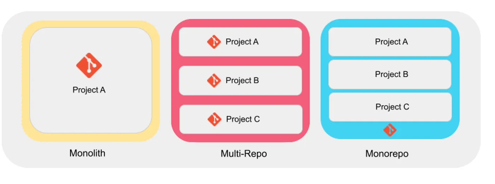

# DevInDays — Project Structure & Architecture

How we organize our codebases, repositories, and applications at DevInDays.

At DevInDays, we work on projects of different sizes, with different requirements, teams, and technology stacks.

Because of that, we do not force every project into the same repository structure.

Instead, we choose an architecture that keeps projects simple to develop, easy to maintain, and practical to scale.

This document explains four common approaches:

- Monolith
- Multi-Repo
- Monorepo
- Microservices

It also explains how DevInDays currently uses these approaches and why we do not use microservices by default.

---

## Table of Contents

- [The Big Picture](#the-big-picture)
- [Monolith](#1-monolith)
- [Multi-Repo](#2-multi-repo)
- [Monorepo](#3-monorepo)
- [Microservices](#4-microservices)
- [How DevInDays Uses These Approaches](#how-devindays-uses-these-approaches)
- [Why We Don’t Use Microservices Yet](#why-we-don-t-use-microservices-yet)
- [Modular Architecture Before Microservices](#modular-architecture-before-microservices)
- [How We Decide](#how-we-decide)
- [Our Engineering Philosophy](#our-engineering-philosophy)
- [In Short](#in-short)
- [Final Takeaway](#final-takeaway)

---

## The Big Picture

Before discussing the individual approaches, it is important to understand that repository structure and application architecture are not exactly the same thing.

A repository describes how code is organized and managed.

An application architecture describes how the application itself is structured and deployed.

<div align="center" class="image-container">

</div>
For example:

```text
Repository / Code Organization
        │
        ├── Monolith
        ├── Multi-Repo
        └── Monorepo
                │
                ▼
Application Architecture
        │
        ├── Monolithic Application
        └── Distributed / Microservices
```

A monorepo does not automatically mean microservices.

A multi-repo setup does not automatically mean microservices either.

These are separate architectural decisions.

---

## DevInDays’ General Approach

At DevInDays, we generally prefer the simplest architecture that adequately solves the problem.

We do not introduce architectural complexity unless the project actually benefits from it.

For a small application, a simple repository and straightforward backend may be enough.

For several independent client projects, separate repositories are usually more appropriate.

For reusable templates and shared code, a monorepo can provide a better development experience.

For very large systems with independently scalable services, microservices may eventually become appropriate.

---

## 1. Monolith

A monolith is an application where the major components of the system live together as one application or codebase.

A simplified structure might look like this:

```text
project/
│
├── frontend/
├── backend/
├── database/
├── authentication/
├── payments/
├── users/
└── ...
```

Everything is developed and usually deployed as part of one application.

### Example

```text
Frontend
   │
   ▼
Backend API
   │
   ▼
Database
```

All of these components belong to the same project.

---

### Advantages

**Simple to Start**

There are fewer moving parts.

A developer can clone the repository and understand the entire project from one place.

**Easy Local Development**

```shell
git clone <repository>
cd project
npm install
npm run dev
```

**Simple Deployment**

The entire application can often be deployed as one unit.

**Good for Small and Medium Projects**

When the application is not particularly large, a monolithic architecture can be perfectly reasonable.

---

### Disadvantages

As the application grows, the codebase can become increasingly interconnected.

For example:

```text
Authentication
      │
      ├── Users
      │      │
      │      ├── Orders
      │      │      │
      │      │      └── Payments
      │      │
      │      └── Notifications
      │
      └── Admin
```

Changes in one part of the system may affect several other areas.

The application can eventually become:

- harder to maintain
- harder to test
- harder to scale independently
- more tightly coupled

However, this does not mean that monoliths are inherently bad.

A well-structured monolith can remain maintainable for a long time.

---

## 2. Multi-Repo

Multi-Repo means that every project has its own Git repository.

For example:

```text
DevInDays Organization
│
├── project-a
├── project-b
├── project-c
└── project-d
```

Each repository is an independent codebase.

---

### Example

Suppose DevInDays is working on three unrelated products:

```text
Project A
└── Git Repository A
Project B
└── Git Repository B
Project C
└── Git Repository C
```

Each project can have:

- its own dependencies
- its own Git history
- its own CI/CD pipeline
- its own deployment
- its own environment variables
- its own technology stack

---

### Advantages

Clear Separation

Every project is isolated.

Developers working on Project A do not need to interact with Project B’s codebase.

Independent Development

Projects can evolve independently.

For example:

```text
Project A → Next.js + FastAPI
Project B → Flutter + Firebase
Project C → Next.js + .NET
```

There is no requirement for all projects to follow the same technology stack.

Independent Deployment

Each repository can have its own:

```text
Development
     ↓
Testing
     ↓
Production
```

pipeline.

Easier Project Ownership

It is immediately clear which repository belongs to which project.

---

### Disadvantages

The biggest disadvantage is code duplication.

Suppose every project needs the same:

Authentication utilities
API helpers
UI components
Configuration
Documentation
Development tooling

With separate repositories, developers may end up maintaining similar code in multiple places.

There can also be repeated:

- configurations
- CI/CD workflows
- dependency updates
- documentation
- setup instructions

Managing a large number of repositories can therefore become time-consuming.

---

## 3. Monorepo

A monorepo stores multiple related applications, packages, or projects inside a single Git repository.

For example:

```text
devindays/
│
├── apps/
│   ├── web/
│   ├── mobile/
│   └── admin/
│
├── packages/
│   ├── ui/
│   ├── shared/
│   └── config/
│
├── docs/
├── scripts/
└── README.md
```

The important idea is:

Multiple projects, one repository.

---

### Visual Overview

The diagram illustrates the fundamental difference between a monolith, multi-repo, and monorepo.

---

### Why Use a Monorepo?

A monorepo becomes particularly useful when multiple applications are closely related.

For example:

```text
DevInDays Platform
│
├── Web Application
├── Mobile Application
├── Admin Dashboard
└── Shared Packages
```

These applications may share:

UI Components
API Models
Types
Utilities
Configuration
Documentation
Design Tokens

Instead of maintaining those things independently, they can live together.

---

Example Monorepo

```text
project/
│
├── apps/
│   ├── web/
│   │   └── Next.js
│   │
│   ├── mobile/
│   │   └── Flutter
│   │
│   └── admin/
│       └── React
│
├── packages/
│   ├── ui/
│   ├── shared/
│   ├── config/
│   └── types/
│
├── docs/
├── scripts/
└── README.md
```

---

### Advantages

Shared Code

Common functionality can be maintained in one place.

```text
packages/
├── ui/
├── shared/
├── types/
└── config/
```

Consistent Tooling

The repository can define common:

- linting rules
- formatting
- TypeScript configuration
- Git conventions
- CI/CD conventions
- documentation standards

Easier Refactoring

When multiple applications depend on the same code, changes can be made within the same repository.

Better Visibility

Developers can understand how related applications fit together without jumping between repositories.

---

### Disadvantages

Monorepos also introduce their own complexity.

As the repository grows:

- build times can increase
- dependency management becomes more important
- CI/CD requires careful configuration
- repository structure needs discipline
- unrelated projects can become unnecessarily coupled

Therefore, a monorepo should be used because the projects are related, not simply because monorepos are popular.

---

## 4. Microservices

Microservices are an application architecture, rather than merely a repository structure.

Instead of building one large application, the system is divided into multiple independently deployable services.

For example:

```text
                    ┌─────────────────┐
                    │  Web / Mobile   │
                    └────────┬────────┘
                             │
            ┌────────────────┼────────────────┐
            │                │                │
            ▼                ▼                ▼
      User Service     Product Service    Order Service
            │                │                │
            ▼                ▼                ▼
        User DB          Product DB        Order DB
```

Each service has a clearly defined responsibility.

---

### Example

A large e-commerce platform might have:

```text
Authentication Service
        │
        ▼
     User DB
Product Service
        │
        ▼
    Product DB
Order Service
        │
        ▼
     Order DB
Payment Service
        │
        ▼
    Payment Provider
Notification Service
        │
        ▼
    Email / SMS / FCM
```

These services can potentially be:

- developed independently
- deployed independently
- scaled independently
- monitored independently

---

### Why Microservices Are Powerful

Microservices can be useful when a system becomes large enough that different parts of the application need independent scaling, deployment, ownership, or fault isolation.

For example:

```text
100 requests/sec
        │
        ▼
Order Service
```

while:

```text
10,000 requests/sec
        │
        ▼
Search Service
```

The two services can potentially be scaled differently.

---

### But Microservices Have a Cost

Microservices introduce substantial operational complexity.

Instead of managing:

```text
1 Application
1 Database
1 Deployment
```

you may need to manage:

```text
10+ Services
10+ Deployments
Multiple Databases
Service Discovery
API Gateway
Message Queues
Logging
Monitoring
Tracing
Authentication
Secrets
Networking
Containerization
Orchestration
```

This means:

Microservices solve certain scaling and organizational problems, but they also create distributed-system problems.

For a small or medium-sized application, introducing microservices too early can add complexity without providing a corresponding benefit.

---

## How DevInDays Uses These Approaches

DevInDays does not use one repository strategy for every project.

We choose the structure according to the project.

Our general approach looks like this:

```text
                         DevInDays
                            │
          ┌─────────────────┼─────────────────┐
          │                 │                 │
          ▼                 ▼                 ▼
       Monolith          Multi-Repo        Monorepo
          │                 │                 │
     Simple apps       Client projects    Templates /
     small MVPs        independent apps   shared code
                            │
                            ▼
                      Microservices
                      Not currently
                         required
```

---

### Monolith — When Simplicity Matters

For smaller applications or MVPs, a straightforward application structure can be the most productive option.

The objective is not to build the most sophisticated architecture possible.

The objective is to build the right architecture for the problem.

A simple project might therefore remain a monolithic application.

Typical examples include:

- small landing platforms
- internal tools
- simple MVPs
- applications where frontend and backend requirements are relatively straightforward

---

### Multi-Repo — Independent Client Projects

For independent client projects, separate repositories are often the natural choice.

For example:

```text
DevInDays Organization
│
├── client-project-a
├── client-project-b
├── client-project-c
└── internal-project-d
```

Each project can have its own:

README
Issues
Branches
CI/CD
Environment
Deployment
Release cycle

This keeps unrelated projects isolated from one another.

It also allows each project to use the technology stack that best fits its requirements.

For example:

Project A
Next.js + FastAPI
Project B
Flutter + Firebase
Project C
Next.js + .NET + PostgreSQL

---

### Monorepo — Templates and Shared Ecosystems

We use the monorepo approach where multiple applications or packages are closely related and benefit from sharing code.

For example:

```text
DevInDays Template
│
├── apps/
│   ├── mobile/
│   ├── web/
│   └── admin/
│
├── packages/
│   ├── ui/
│   ├── shared/
│   └── config/
│
└── docs/
```

This is particularly useful for:

- reusable starter templates
- internal boilerplates
- shared UI components
- shared utilities
- related applications
- common development tooling

The goal is to avoid repeatedly rebuilding the same foundation.

---

## Why We Don’t Use Microservices Yet

At the current stage of DevInDays projects, microservices are not our default architecture.

This is a deliberate engineering decision.

Our current projects generally benefit more from:

```text
Simple architecture
        +
Clear boundaries
        +
Fast development
        +
Easy deployment
        +
Low operational overhead
```

than from introducing a distributed system prematurely.

---

### This Does Not Mean Microservices Are Bad

Microservices are not inherently better or worse than a monolith.

They solve a different class of problems.

A useful progression can look like:

```text
Small Project
     │
     ▼
Modular Monolith
     │
     ▼
Larger Application
     │
     ▼
Identify Independent Domains
     │
     ▼
Extract Services Where Necessary
     │
     ▼
Microservices
```

We should not jump directly to the final step unless the project genuinely requires it.

---

## Modular Architecture Before Microservices

There is an important middle ground between a messy monolith and microservices:

A well-structured modular monolith.

For example:

```text
backend/
│
├── auth/
├── users/
├── payments/
├── orders/
├── notifications/
└── admin/
```

Each module has clear responsibilities and boundaries.

Conceptually:

```text
┌─────────────────────────────────────┐
│          Single Application         │
│                                     │
│  ┌───────┐ ┌────────┐ ┌─────────┐ │
│  │ Auth  │ │ Orders │ │ Payments│ │
│  └───────┘ └────────┘ └─────────┘ │
│                                     │
└─────────────────────────────────────┘
```

This allows us to keep deployment simple while still maintaining strong internal boundaries.

If one of these modules eventually needs to become an independent service, the separation already exists.

---

## How We Decide

Before choosing an architecture, we consider several factors.

1. Project Size

How large is the application?

2. Team Size

How many developers will work on it?

3. Relationship Between Applications

Are the applications independent or tightly related?

4. Code Sharing

Do multiple applications need the same code?

5. Deployment Requirements

Do different components need to be deployed independently?

6. Scaling Requirements

Does one part of the system need to scale independently?

7. Operational Complexity

Can the team reasonably maintain the infrastructure?

8. Future Growth

Will the current architecture make future development easier or harder?

---

### A Simple Decision Model

```text
                     Start
                       │
                       ▼
             Is this one small app?
                  /          \
                Yes           No
                │              │
                ▼              ▼
             Monolith     Are projects
                          independent?
                           /       \
                         Yes        No
                         │           │
                         ▼           ▼
                     Multi-Repo   Monorepo
                                      │
                                      ▼
                             Does the system
                             require independently
                             scalable services?
                                      │
                                  ┌───┴───┐
                                 No      Yes
                                  │        │
                                  ▼        ▼
                              Monorepo   Consider
                              / Modular  Microservices
                              Monolith
```

This is not a rigid rule.

Architecture should always be evaluated against the actual requirements of the project.

---

## Our Engineering Philosophy

At DevInDays, we believe architecture should serve the product — not the other way around.

We therefore prefer:

Simple where possible.
Modular where necessary.
Scalable where justified.

We do not adopt an architecture simply because it is popular.

A technology or architecture should earn its place in a project by solving a real problem.

---

## In Short

| Approach | What It Means | DevInDays Usage |
| --- | --- | --- |
| Monolith | One application/codebase | Small apps, MVPs, simpler systems |
| Multi-Repo | Separate repository per project | Independent client projects |
| Monorepo | Multiple related apps/packages in one repository | Templates, shared code, related applications |
| Microservices | Multiple independently deployable services | Not currently required; considered when justified by scale |

---

## Final Takeaway

There is no universally “best” architecture.

A repository containing ten applications is not automatically better than ten repositories.

A microservices system is not automatically better than a monolith.

A monorepo is not automatically better than a multi-repo setup.

The right question is:

What structure allows the team to build, maintain, deploy, and evolve this particular product most effectively?

That is the principle we follow at DevInDays.

Build for today’s requirements.
Design with tomorrow in mind.
And introduce complexity only when it buys us something meaningful.

---

<p align="center">
  <strong>DevInDays</strong><br>
  Engineering with clarity. Building for what comes next.
</p>
